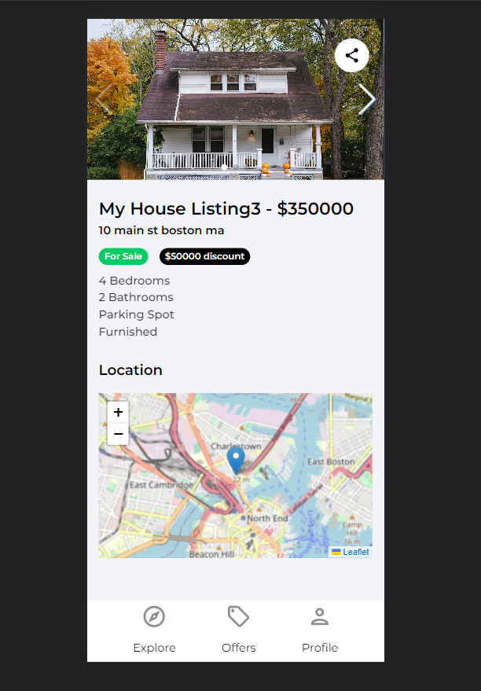
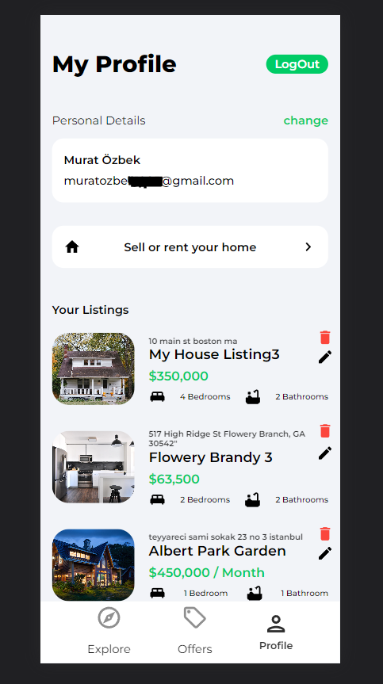

# House Marketplace App

This repository contains the source code for the House Marketplace App, a React-based web application that serves as a marketplace for houses. Users can browse, search, and view houses available for sale or rent. The app integrates various technologies and APIs to provide a seamless user experience.

## Features

- Browse and search houses based on location, price range, and other filters.
- View detailed information about each house, including description, price, amenities, and contact details of the seller.
- Utilize a map powered by Leaflet to visualize the location of each house.
- Retrieve real-time weather information using the Google Weather API based on the user's geolocation.
- Swipe through carousels and sliders using the Swiper library to view multiple images of each house.
- Receive error notifications using React Toastify to enhance user feedback.

## Technologies Used

- React: A JavaScript library for building user interfaces.
- Firebase: A backend-as-a-service platform used for the app's database.
- Leaflet: An open-source library for interactive maps in JavaScript.
- Google Weather API: An API provided by Google for retrieving weather information.
- Swiper: A mobile touch slider library for sliding through elements.
- React Toastify: A notification library for displaying success, error, and other types of messages.

## Project Structure

The project's codebase is organized as follows:

- `src`: Contains the main source code files for the app.
- `components`: Contains reusable React components used throughout the app.
- `pages`: Contains the different pages of the app.
- `services`: Contains modules for interacting with external APIs and services.
- `utils`: Contains utility functions used in the app.
- `public`: Contains static assets such as images and the `index.html` file.

Feel free to explore the code and make any necessary modifications or additions to suit your needs.

## License

The House Marketplace App is released under the [MIT License](https://opensource.org/licenses/MIT). Feel free to use, modify, and distribute the code as per the terms of the license.

## Contact

If you have any questions, suggestions, or issues related to the House Marketplace App, please contact the development team at `https://twitter.com/Murattozzk`. We appreciate your feedback and involvement in making the app better.

Happy house hunting!
